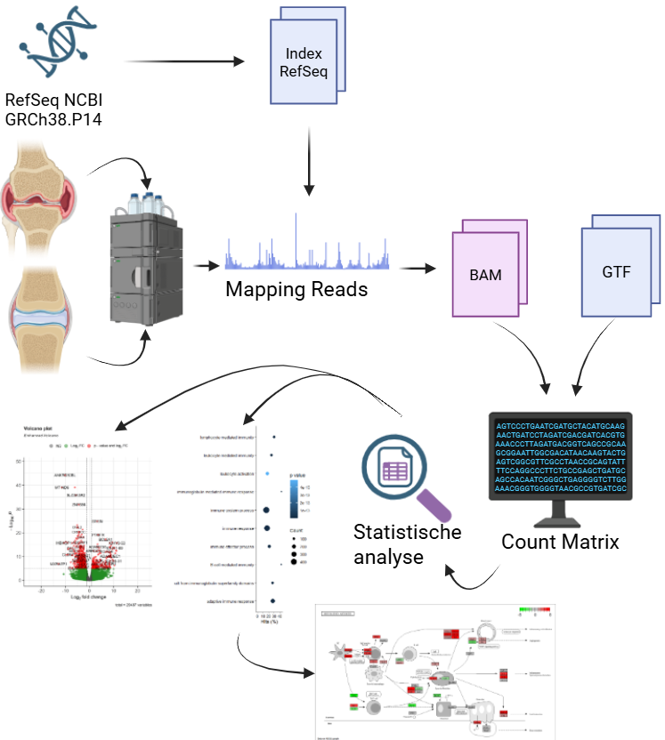
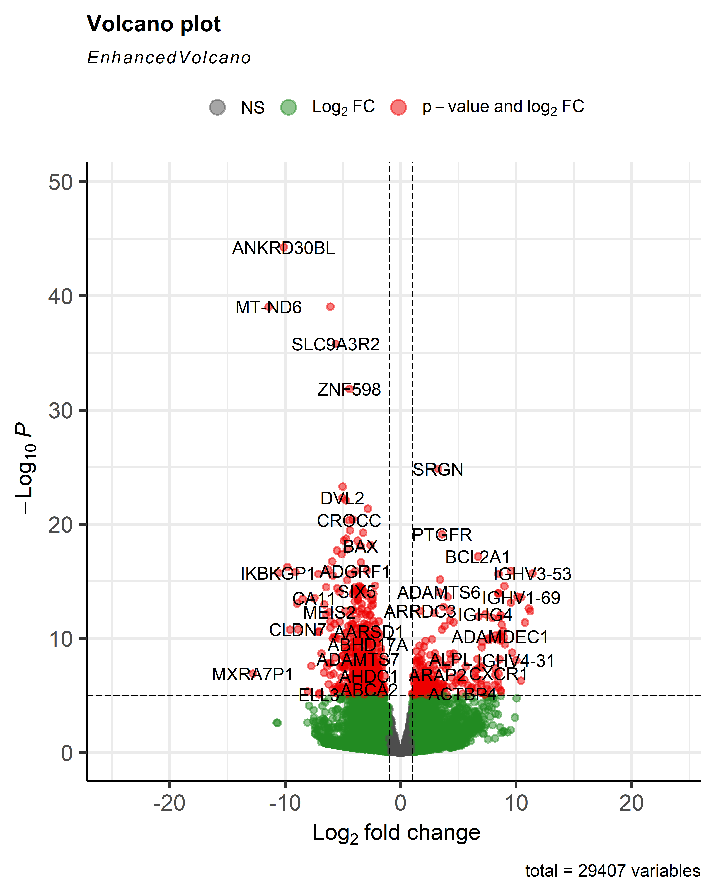
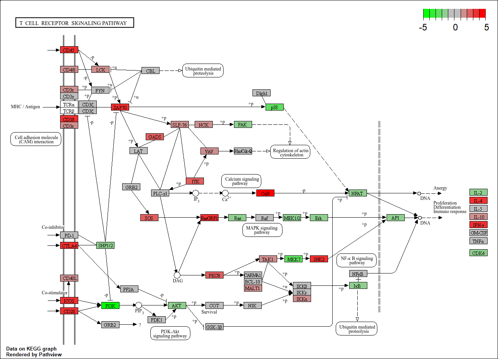

# Transcriptomics-Casus-Reuma-Artritius

# Inleiding
Reumatoïde artritis (RA) is een chronische auto-immuunziekte die vooral veel voorkomt bij vrouwen op oudere leeftijd. De ziekte veroorzaakt ontstekingen in gewrichten, dat ontstaat doordat het lichaam het slijmvlies in de gewrichten aanvalt. Dit zorgt voor pijn in de gewrichten, gepaard met stijfheid en vermoeidheid. RA is ongeneesbaar, maar wel te behandelen met reumaremmers en pijnstillers (Majithia & Geraci, 2007).

5 op de 1000 mensen hebben RA (Aletaha & Smolen, 2018). Desondanks zijn de precieze oorzaken van de ziekte nog onbekend, al lijken onderzoeken aan te duiden dat er verbindingen zijn met genetische- en omgevingsfactoren (Tobón et al., 2010). Daarom is het belangrijk om te onderzoeken welke genen meer of minder tot expressie komen bij mensen met RA. In dit onderzoek wordt met transcriptomics bekeken welke genen in het gewrichtslijmvlies van mensen met RA meer of minder tot expressie komen.  

# Methode
Om te kijken naar een verschil in genexpressie, zijn monsters uit het gewrichtslijmvlies bij 4 mensen met RA en 4 gezonde mensen (controle) vergeleken. Deze mensen hebben een leeftijd tussen de 15 en 66 jaar en zijn van het vrouwelijk geslacht. Voor dit onderzoek is R (4.6.0) (Download R-4.6.0 For Windows.  The R-project For Statistical Computing., z.d.) gebruikt en voor het downloaden van packages is Biocmanager (1.30.27) (Bioconductor - Install, z.d.) gebruikt, daarnaast zijn de volgende packages gebruikt: Rsubread (2.26.0) (Rsubread, z.d.-b), Rsamtools (2.28.0) (RSAmTools, z.d.), dplyr (1.2.1) (A Grammar Of Data Manipulation, z.d.), readr (2.2.0) (Readr Package - RDocumentation, z.d.), DESeq2 (1.52.0) (Thelovelab, z.d.), KEGGREST (1.52.2) (KEGGREST, z.d.) pathview (1.52.0) (Datapplab, z.d.), goseq (1.64.0) (Federicomarini, z.d.) en GO.db (3.23.1) (GO.DB, z.d.).

Voor de eerste stappen van de analyse, zijn de reads eerst gemapt. Voor het mappen is als referentiegenoom het humane genoom (GRCh38.P14) gebruikt van NCBI (Homo Sapiens Genome Assembly GRCh38.p14, z.d.). Hierna wordt het genoom geïndexeerd en aligned [Script 1]([https://github.com/Richt01/Casus-Transcriptomics-reuma/](https://github.com/MerlinLightmoon/Transcriptomics-Reuma-Artritius-Casus/blob/main/Scripts/Casus_1.R). Vervolgens is er een countmatrix gemaakt, het gtf bestand hiervoor is ook van NCBI gedownload (Homo Sapiens Genome Assembly GRCh38.p14, z.d.) (Script 2). Waarna een volcano plot is gemaakt om de statistisch significante genen die differentieel tot expressie komen te visualiseren na het analyseren (script 3). 

Daarna is een Gene Ontologie (GO) analyse uitgevoerd om te bepalen welke biologische processen zijn betrokken met de verandering in genexpressie. Na het observeren van de GO-analyse is gekozen te kijken naar de algemene RA pathway (hsa05323) gezien veel van de GO-termen uit de GO-analyse hier een connectie mee hebben. Ook is er meer verdiept in de T-cel synthese (hsa04660).

  

# Resultaten

  

  

  

  

# Conclusie

# Bronnen
A Grammar of Data Manipulation. (z.d.). https://dplyr.tidyverse.org/

Aletaha, D., & Smolen, J. S. (2018). Diagnosis and Management of Rheumatoid Arthritis. JAMA, 320(13), 1360. https://doi.org/10.1001/jama.2018.13103

Bioconductor - Install. (z.d.). https://bioconductor.org/install/

Datapplab. (z.d.). GitHub - datapplab/pathview: pathway based data integration and visualization. GitHub. https://github.com/datapplab/pathview

Download R-4.6.0 for Windows.  The R-project for statistical computing. (z.d.). https://cran.r-project.org/bin/windows/base/

Federicomarini. (z.d.). GitHub - federicomarini/goseq. GitHub. https://github.com/federicomarini/goseq

GO.DB. (z.d.). Bioconductor. https://bioconductor.org/packages/release/data/annotation/html/GO.db.html

Homo sapiens genome assembly GRCh38.p14. (z.d.). NCBI. https://www.ncbi.nlm.nih.gov/datasets/genome/GCF_000001405.40/

KEGGREST. (z.d.). Bioconductor. https://bioconductor.org/packages/release/bioc/html/KEGGREST.html

Majithia, V., & Geraci, S. A. (2007). Rheumatoid Arthritis: Diagnosis and Management. The American Journal Of Medicine, 120(11), 936–939. 

https://doi.org/10.1016/j.amjmed.2007.04.005

readr package - RDocumentation. (z.d.). https://www.rdocumentation.org/packages/readr/versions/2.1.5

RSAmTools. (z.d.). Bioconductor. https://www.bioconductor.org/packages/release/bioc/html/Rsamtools.html

Rsubread. (z.d.). Bioconductor. https://bioconductor.org/packages/release/bioc/html/Rsubread.html
